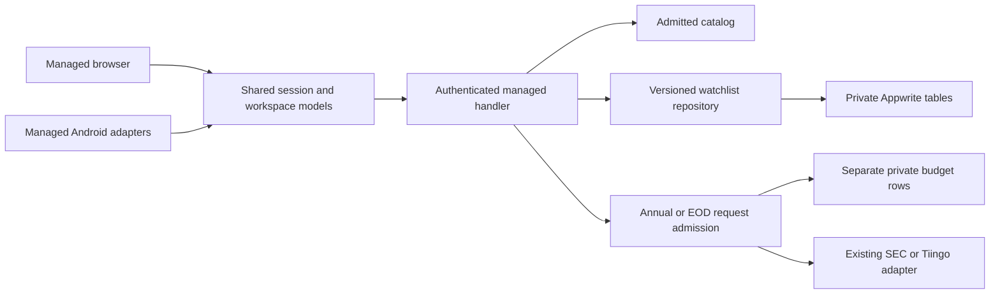

# Architecture

Investment uses shared TypeScript contracts and domain modules across distinct
runtime profiles. [Current work](CURRENT_WORK.md) records which surfaces are
actually delivered; the presence of a component does not make it available in
every profile.

## Runtime map

| Runtime                 | Entry and composition                                                                                                                                                                   | Boundary                                                                                                |
| ----------------------- | --------------------------------------------------------------------------------------------------------------------------------------------------------------------------------------- | ------------------------------------------------------------------------------------------------------- |
| Synthetic demo          | Next.js in `apps/web`; Fastify [server.ts](../apps/api/src/server.ts)                                                                                                                   | Invented fixtures and loopback development; no production credentials                                   |
| Local personal research | [workspace-server.ts](../apps/api/src/workspace-server.ts) and the Next.js research UI                                                                                                  | Explicit admitted local catalog, owner-local session and encrypted vault; separate from managed storage |
| Managed browser         | [Vite configuration](../apps/web/vite.clerk-trial.config.ts), [main.tsx](../apps/web/src/clerk-trial/main.tsx), [ClerkTrialApp](../apps/web/src/clerk-trial/ClerkTrialApp.tsx)          | Production browser origin, official Clerk React session, authenticated managed API                      |
| Managed Android         | Same Vite feature layer through [NativeTrialApp](../apps/web/src/clerk-trial/NativeTrialApp.tsx), [native session adapter](../apps/web/src/clerk-trial/native-session.ts) and Capacitor | Bundled assets at `https://localhost`; official Clerk Android SDK; native Back/lifecycle adapter        |
| Managed service         | [managed-workspace-function.ts](../apps/api/src/managed-workspace-function.ts) → [handler](../apps/api/src/managed-workspace-handler.ts) and services                                   | Server-side account/catalog admission, private Appwrite data and bounded provider requests              |

The current managed website is a Vite bundle, not the entire Next.js research
application. Historical names such as `clerk-trial` remain in shared filenames;
explicit configuration selects trial versus production behavior. The disconnected
Android profile cannot silently become a connected client.

## State and identity ownership

[ManagedWorkspaceScreen](../apps/web/src/clerk-trial/ManagedWorkspaceScreen.tsx)
renders the session-owned [workspace model](../apps/web/src/clerk-trial/managed-workspace.ts).
The [save coordinator](../apps/web/src/clerk-trial/save-coordinator.ts) owns command
identity, conflicts and uncertain saves. Catalog reads have their own lifetime;
they cannot clear a pending save. Session changes retire the old workspace and
fence late responses.

[Annual](../apps/web/src/clerk-trial/managed-annual-report.ts) and
[EOD](../apps/web/src/clerk-trial/managed-eod-history.ts) have separate read models.
Opening a panel makes no source request. Selection includes the exact catalog
digest and listing identity. Responses must still match that captured selection
before display. The workspace stays mounted while a panel is open, preserving
unsaved note/order state. Closing restores focus through the same screen action
used by [Android Back](../apps/web/src/mobile/android-back.ts).

The selected [Markets home](MANAGED_MARKETS_HOME.md) adds a visit-scoped board
model owned by the same workspace. It resolves a declared exact cohort and loads
prices sequentially only on request. Board and EOD panel share one checked
cooldown owner; their price snapshots remain separate. Navigation leaves the
watchlist coordinator mounted. Leaving Markets clears its board data, and
catalog/session retirement aborts every affected research read.

The board derives each raw-close comparison from the final two dated rows of
that listing's validated response. The existing market-analytics package owns
exact decimal subtraction and percentage rounding. UI formatting exposes both
dates, direction and the unadjusted basis. There is no additional response store,
request or lifetime: a replacement history replaces its comparison, retained
history keeps its original comparison, and clearing the response clears both.

Each read model can retain its last validated response during explicit refresh
and its defined recoverable failures. The panel marks that response as previous
and preserves its original provenance. ManagedWorkspace owns one company visit
with a captured selection and active Price or Annual section. Switching cancels
pending work and retains validated results; returning reuses the initialized
model. Closing or invalidating the visit clears both models. No persistent cache
is added.

The company visit's watchlist-note controls derive from its captured selection
and the coordinator's current draft. Complete identity and catalog matching
guard edits and explicit additions. The editor shares the watchlist row's draft;
reviewing My Watchlist closes research and uses the existing full-list save and
reconciliation flow. There is no second note store or save coordinator.

Issuer, security, share class, listing and provider symbol are separate concepts.
[Contracts](../packages/contracts/src/index.ts) validate wire data; the
[security-master package](../packages/personal-security-master/) owns catalog
admission and identity lookup. Never substitute a ticker match for a full identity
join. GOOG and GOOGL are distinct listings even though their issuer is shared.

## Service and storage

The managed function verifies its public configuration before composition. The
handler enforces method, origin, body size, authentication and route contracts.
Browser and native request profiles are explicit. CORS and native Origin checks
are not installation attestation.

The [Appwrite transport](../apps/api/src/appwrite-transport.ts) bounds the SDK's
requests, bytes, deadlines and cleanup. The
[watchlist repository](../apps/api/src/appwrite-watchlist-repository.ts) stores
canonical full payloads and command receipts with optimistic versions. An unknown
commit outcome does not authorize a new write; explicit receipt reconciliation
retains the original command key. Clients receive no table or row write grant.

Annual and EOD services reuse existing providers and shared validation. Their
separate [Annual admission](../apps/api/src/managed-sec-annual-admission.ts) and
[EOD admission](../apps/api/src/managed-eod-admission.ts) grant source work only
after a timely acknowledged shared reservation. Provider work has server deadlines
because a browser cancellation is not proven to cancel the remote Appwrite request.

The budgets store admission metadata, not price or filing bodies. EOD rows remain
in the company visit or Markets board's memory. The local encrypted vault is a separate persistence
model; managed Appwrite storage does not claim equivalent application-layer
encryption or automatic migration.

## Configuration and trust

The [managed function builder](../scripts/clerk-trial/build-function.ts) requires
separate identity, SEC and EOD inputs. Explicit null feature configuration closes
that feature. Provider keys are server-only private runtime inputs; they do not
belong in a client bundle, command arguments, logs or context export. Public Clerk
configuration identifies the environment and origin but does not authorize a user.

[Catalog](MANAGED_SECURITY_CATALOG.md), [watchlist](APPWRITE_WATCHLIST.md),
[Annual](MANAGED_SEC_ANNUAL.md) and [EOD](MANAGED_EOD_HISTORY.md) guides define the
exact limits. A new listing/feed needs permitted use, identity/currency mapping
and bounded acceptance. The small current cohort is not a whole-market claim.

## Verification and release

Routine tests use synthetic data. The native managed fixture is packaged only in
the test APK and uses an invented session/API; it does not bypass production
admission. The native suite requires twelve cases; accepted results are recorded in Current work.
These are distinct from signed-release, physical-phone and
live-provider acceptance.

[Source-check verification](../scripts/appwrite/github-checks.ts) derives the
applicable workflows/jobs from the actual diff and workflow bytes. Successful
Linux CI retains the source-proof artifact for the exact producing attempt.
[Delivery source checks](APPWRITE_DELIVERY.md#release-sequence) cover current
candidates. The older [release-classification generator](RELEASE_CLASSIFICATION.md)
has a separate historical filing-evidence contract; it is not required merely
because a managed UI feature changes.

API deployment, website release and Android packaging are separate actions:

- The managed API has explicit source/configuration/schema/budget acceptance,
  inactive upload, readiness and guarded activation.
- The [website workflow](../.github/workflows/appwrite-site-release.yml) builds once,
  checks the inert staging preview, then promotes the same archive through normal
  production approval. This does not prove authenticated research.
- [Android packaging](ANDROID_CLIENT.md) binds source and client assets to an
  explicit profile, package/version and signer; the final manifest and archive
  need their own review. A signed artifact is not an observed upgrade.

Keep the public context focused. [AI context](AI_CONTEXT.md) explains manual source reading and the pending Repomix integration;
[historical README](history/README-2026-10-03.md), build records and ADRs remain
available when a task needs their dated details. Private operational evidence,
owner data and custody are intentionally absent from this repository.
